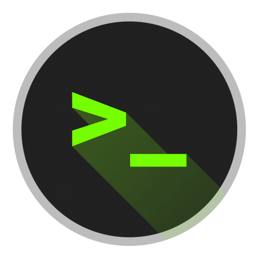

# New-Mac-Config

<p align="center">
    
</p>

<h1 align="center">Dotfiles Template</h1>

#### Requirements
- macOS Catalina or above

## Goal 
Setting up a new mac can be a painful experience when it has to be done from scratch. Making sure that you have configured correctly your machine with the same packages, aliases, terminal preferences and general customizations is almost impossible to replicate each time.

The purpose of this project is to serve as a template for your dotfiles configuration, abstracting all the complexity that manually configuaring your machine comes with.

## This script installs:
#### Brew
- Setup HomeBrew.
####
- [Brew Casks](https://formulae.brew.sh/cask/)
    - Iterm2
    - Visual Studio Code
    - Slack
    - Proxyman
    - Spotify
    - Notion
    - Caffeine

- [Brew Packages](https://brew.sh)
    - dockutil
    - fasd
    - fzf
    - z
    - git
    - mas
    - n
    - rcm
    - trash
    - diff-so-fancy
    - robotsandpencils/made/xcodes
    - thefuck
    - shellcheck

In case you want to **add** or **remove** any of the **casks** or **packages** listed above, all you have to do is to edit the `Brewfile` that lives under the **brew** folder.

#### Oh-My-Zsh
#### Zinit
#### Custom Packages
- Git
- Vim
- Zinit
#### MacOS
- Dark mode activation
- Typping speed and key sleep
- Dock manipulation
- iTerm2 customization
#### Xcode
#### Generate SSH-Key

## How to run
```shell
git clone repo-ssh-clone-link
cd Dotfiles-Template
chmod +x setup.sh
sh setup.sh "Your custom ssh password"
```

## Tests
At the end of the setup script, the tests are automatically triggered and a report is printed to the screen.

<p align="center">
    
</p>
